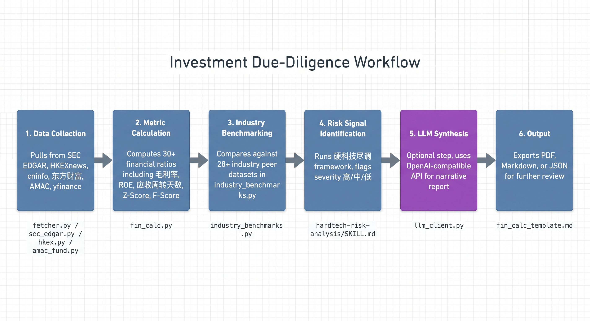

<p align="center">
  
</p>

<h1 align="center">Pre-Diligence Lab</h1>

<p align="center">
  一级市场投研与风控桌面工作台<br>
  Primary-Market Investment Research &amp; Risk-Control Workbench
</p>

<p align="center">
  <a href="#下载与安装">下载</a> &middot;
  <a href="#快速上手">快速上手</a> &middot;
  <a href="#功能详解">功能详解</a> &middot;
  <a href="#llm-配置">LLM 配置</a> &middot;
  <a href="#从源码构建">从源码构建</a> &middot;
  <a href="#许可证">许可证</a>
</p>

---

## 关于本项目

**Pre-Diligence Lab** 是一款面向一级市场投研人员的本地化桌面工具，覆盖 Pre-IPO / 私募 / 并购 / 硬科技尽调等场景下从「**拉数据**」到「**算指标**」到「**出报告**」的完整链路。

应用以 PyQt6 桌面 GUI 为载体，将分散在 SEC EDGAR、HKEXnews、巨潮资讯、东方财富、中基协 AMAC、Yahoo Finance 等十余个公开数据源的财务披露、行情、新闻、公告、备案信息聚合到统一界面，并内置 30+ 项财务比率计算、28+ 个行业的同业对标基准、以及硬科技 / 半导体 / AI 行业的财务风险分析框架。

所有用户输入（搜索历史、收藏、API Key、配置）均落盘在本地 `~/.prediligencethelab/`，**不向任何第三方服务端上传**。LLM 为可选功能，未配置时所有数据抓取、计算、图表功能均可正常使用。

---

## 适用场景

- **PE / VC 投资经理**：在投前对拟投企业做行业对标 + 财务风险预筛
- **Pre-IPO 研究员**：拉取并整理拟上市企业的财报与同业披露
- **并购尽调团队**：在签署 NDA 前对目标公司做工商、失信、专利、裁判文书公开层穿透
- **二级市场分析师**：跨市场横向看同业上市公司财务结构变化
- **硬科技 / 半导体行业研究者**：使用内置的三层分析框架（真实性 → 现金流 → 盈利质量）做行业级深度诊断

---

## 系统要求

| 项目 | 要求 |
| --- | --- |
| Python | 3.10 ~ 3.12（推荐 3.11） |
| 操作系统 | macOS 11 及以上 / Windows 10 及以上 / Ubuntu 20.04 及以上 |
| 内存 | 4 GB 及以上 |
| 磁盘 | 500 MB 可用空间（不含年报 PDF 缓存） |
| 网络 | 需联网访问 SEC EDGAR / HKEXnews / 巨潮资讯等数据源 |
| 显示器 | 1366 × 768 及以上（推荐 1920 × 1080） |

---

## 下载与安装

### 方式一：下载预编译包（推荐普通用户）

到 [Releases](https://github.com/AlanSong2077/PreDiligenceLab/releases) 页面下载对应平台的安装包：

| 平台 | 文件 | 说明 |
| --- | --- | --- |
| Windows | `PreDiligenceLab-Setup-x.y.z.exe` | Inno Setup 一键安装版，含开始菜单快捷方式、卸载入口 |
| Windows | `PreDiligenceLab-x.y.z-windows-x64.zip` | 绿色版，解压即用，不写注册表 |
| macOS | `PreDiligenceLab-x.y.z-macOS.zip` | 解压后将 `PreDiligenceLab.app` 拖入 `/Applications` |

> macOS 首次启动若提示「无法验证开发者」，请在「系统设置 → 隐私与安全性」中点击「仍要打开」。

### 方式二：从源码运行（开发者）

```bash
git clone https://github.com/AlanSong2077/PreDiligenceLab.git
cd PreDiligenceLab
python -m venv .venv
source .venv/bin/activate          # Windows: .venv\Scripts\activate
pip install -r requirements.txt
python main.py
```

启动后侧边栏将默认显示「年报查询」标签页。在搜索框输入股票代码（例如 `AAPL`、`600519`、`00700`）并按回车即可开始。

---

## 快速上手

应用启动后，主界面由左侧栏（导航 + 搜索 + 一键分析 + 收藏）与右侧主内容区构成：

<p align="center">
  
</p>

1. **搜索**：顶部搜索框支持三种市场的代码格式
   - 美股：`AAPL`、`TSLA`、`MSFT`
   - 港股：`00700` / `700` / `00700.HK`
   - A 股：`600519`、`000001`、`300750`
2. **导航**：左侧栏的十个功能模块可独立切换，状态栏会保留当前查询的公司
3. **一键分析**：搜索结果出现后，点击侧栏的「一键分析」按钮，自动基于当前公司公开数据生成投研简报
4. **收藏**：任意公司卡片右上角的星标可加入收藏夹（上限 50 个），收藏列表在侧栏底部

---

## 功能详解

### 1. 年报查询

跨市场检索上市公司的年报、半年报、季报、临时公告原始文件。点击「下载」后 PDF 直接落到本地 `~/Downloads/PreDiligenceLab/<market>/<code>/`。

<p align="center">
  
</p>

| 市场 | 数据源 | 覆盖文件类型 |
| --- | --- | --- |
| 美国 | SEC EDGAR | 10-K, 10-Q, 8-K, DEF 14A, S-1, 20-F |
| 中国香港 | HKEXnews | 年报、中期报告、ESG 报告、通函、公告 |
| 中国大陆 | 巨潮资讯（cninfo） | 年报、半年报、季报、临时公告、招股说明书 |

### 2. 公开信息披露

按市场分标签展示企业基础披露信息，包括公司全称、注册地、上市板、市值、52 周高低、所属行业、实际控制人 / 主要股东，以及最新公告列表。

<p align="center">
  
</p>

### 3. 消息引擎

多源新闻聚合 + 利空 / 利好自动打标。抓取来源包括东方财富、新浪财经、Baidu 财经、Google News RSS、Yahoo Finance、HKEX 投资者公告。

<p align="center">
  
</p>

按时间倒序展示，可按以下类别过滤：

- **公司公告**：监管披露、回购、分红、人事变动
- **行业新闻**：所属行业的政策、市场动态
- **研报**：券商与卖方研究观点
- **利好 / 利空**：基于标题与正文的语义分类标签

### 4. 同行业搜索

自然语言描述公司特征，由 LLM 推荐最相近的 A / H / 美股上市公司，并按相关度评分排序。

<p align="center">
  
</p>

例如输入「国产 GPU 芯片设计公司，已上市，营收 10 亿以上」，返回：

| 公司 | 代码 | 上市地 | 总市值 | 主营行业 | 相关度 | 30 日涨跌 |
| --- | --- | --- | --- | --- | --- | --- |
| 寒武纪 | 688256.SH | 上交所科创板 | 285 亿 | AI 芯片 | 92% | -8.4% |
| 海光信息 | 688041.SH | 上交所科创板 | 1450 亿 | 服务器 CPU | 89% | +12.1% |
| 景嘉微 | 300474.SZ | 深交所创业板 | 280 亿 | GPU 芯片 | 85% | -3.2% |
| 龙芯中科 | 688047.SH | 上交所科创板 | 350 亿 | CPU 设计 | 82% | +5.6% |

### 5. 私募基金

对接中基协 AMAC 公开备案数据，按管理人 / 基金名检索，展示登记编号、登记日期、注册资本、法定代表人、注册地，以及在管基金列表与基金类型 / 规模。

<p align="center">
  
</p>

### 6. 工商信息尽调

通过统一社会信用代码 / 公司名 / 股票代码检索，展示工商注册基本信息，并提供以下四类公开层穿透：

- **失信记录**：被执行人、限高、终本案件
- **裁判文书**：涉案身份、案由、审理法院、判决结果
- **专利信息**：发明专利、实用新型、外观设计的申请 / 授权时间线
- **对外投资**：子公司、参股公司、对外担保明细

<p align="center">
  
</p>

### 7. 财务计算器

输入一份简化的财报数据（万元），自动计算 30+ 项财务指标，并与同行业上市公司基准做雷达图叠加对比。

<p align="center">
  
</p>

**指标分组**

| 分组 | 包含指标 |
| --- | --- |
| 盈利能力 | 毛利率、营业利润率、净利润率、ROE、ROA、扣非 ROE |
| 营运能力 | 应收周转天数、存货周转天数、总资产周转率 |
| 偿债能力 | 资产负债率、流动比率、速动比率、利息保障倍数 |
| 现金流质量 | CFO / 净利润、自由现金流、资本开支强度 |
| 估值 | PE-TTM、PE-Forward、PB、PS、EV/EBITDA |
| 风险评分 | Altman Z-Score、Beneish M-Score、Piotroski F-Score |

**覆盖行业基准**（`industry_benchmarks.py` 内置，最近一期年报口径）

半导体 / 软件开发 / 计算机设备 / 通信设备 / 医疗器械 / 生物制品 / 化学制药 / 新能源 / 光伏设备 / 储能 / 汽车整车 / 汽车零部件 / 消费电子 / 家用电器 / 银行 / 证券 / 保险 / 房地产开发 / 建筑装饰 / 食品饮料 / 白酒 / 零售 / 化工 / 钢铁 / 有色金属 / 物流 / 航空 / 港口

### 8. 财务风险因子识别

针对硬科技 / 半导体 / AI 行业设计的风险信号识别工具，输出按严重程度（高 / 中 / 低）排序的检查项。基于 `hardtech-risk-analysis/SKILL.md` 中的三层分析框架：

1. **真实性检验**：收入与现金匹配度、应收占比、毛利率偏离度、收入与存货交叉验证
2. **现金流检验**：净现比、现金消耗速度、融资依赖度
3. **盈利质量检验**：扣非净利润、研发费用率、毛利率趋势、研发资本化率
4. **结构与偿债**：明债结构、暗债（利息保障倍数）、资产质量
5. **行业特殊性**：研发资本化合理性、存货跌价、政府补助占比、商誉与无形资产

<p align="center">
  
</p>

每条信号附有触发逻辑、行业阈值、诊断建议，并支持导出为 Markdown 报告。

### 9. 一键分析（LLM 增强）

基于当前查询的公司，自动调用 LLM 综合已抓取的公开数据生成结构化投研简报，覆盖公司概况、财务健康度、同业对标、主要风险、数据缺口五个标准段落。

<p align="center">
  
</p>

支持后续追问、追加约束（如「重写为三段，每段不超过 100 字」），上下文在会话内保留。

---

## 架构与数据流

<p align="center">
  
</p>

<p align="center">
  
</p>

**关键模块对照表**

| 模块 | 职责 | 公开接口 |
| --- | --- | --- |
| `main.py` | GUI 主程序、侧栏导航、主标签页 | — |
| `theme.py` | 全局颜色 / 字体 / 边距常量 | — |
| `logger.py` | 日志（轮转落盘到 `~/.prediligencethelab/logs/`） | `get_logger()` |
| `fetcher.py` | 跨市场年报 / 公告下载 | `fetch_us_annual_reports()`, `fetch_hk_annual_reports()`, `fetch_cn_annual_reports()` |
| `sec_edgar.py` | SEC EDGAR API 封装 | `get_company_facts()`, `get_filings()` |
| `hkex.py` | HKEXnews 检索与解析 | `search_filings()` |
| `amac_fund.py` / `amac_panel.py` | 中基协 AMAC 公开数据 | `query_manager()`, `query_funds()` |
| `fin_calc.py` | 财务指标计算与行业对标 | `calculate_metrics()`, `analyze_vs_industry()` |
| `industry_benchmarks.py` | 28+ 行业基准数据（离线内置） | `INDUSTRY_BENCHMARKS` |
| `peer_scanner.py` | 同行业公司扫描 | `scan_peers()` |
| `news_fetcher.py` / `web_search.py` | 多源新闻抓取 | `fetch_news()` |
| `biz_lookup.py` / `biz_info_panel.py` | 工商信息 | `lookup_company()` |
| `due_diligence_panel.py` / `dd_form_panel.py` | 尽调表单 | — |
| `llm_client.py` | OpenAI 兼容 LLM 客户端 | `LLMClient`, `load_config()`, `save_config()` |
| `market_utils.py` | 市场识别与代码规范化 | `detect_market()`, `normalize_code()` |

---

## LLM 配置

LLM 为可选功能。未配置时所有数据抓取、计算、图表功能均可使用，仅无法使用「一键分析」与「同行业搜索」中的 AI 推荐。

### 支持的 Provider

| Provider | Base URL | 默认模型 |
| --- | --- | --- |
| OpenAI | `https://api.openai.com/v1` | `gpt-4o-mini` |
| DeepSeek | `https://api.deepseek.com/v1` | `deepseek-chat` |
| 通义千问（Qwen） | `https://dashscope.aliyuncs.com/compatible-mode/v1` | `qwen-turbo` |
| 自定义（OpenAI 兼容） | 用户填写 | 用户填写 |

### API Key 存储

API Key 优先存入**系统密钥环**：

- macOS：Keychain
- Windows：Credential Vault
- Linux：Secret Service

当系统密钥环不可用时（如无 GUI 的 Linux 服务），降级写入 `~/.prediligencethelab/config.json`，文件权限设为 `600`（仅 owner 可读写）。**配置不会上传到任何服务端**。

### 配置步骤

1. 启动应用，点击右上角「设置」→「LLM 配置」
2. 选择 Provider，填入 API Key（仅本地保存）
3. 点击「测试连接」验证
4. 点击「保存」即可

支持的请求格式：

- OpenAI：原生 `response_format` + `json_schema` Structured Outputs（gpt-4o / o1 / o3 系列）
- DeepSeek / 自定义：`json_object` mode
- 通义千问：通过 `json_object` 参数启用 JSON 返回

---

## 数据与隐私

### 数据来源

所有数据均来自**公开可访问**的金融信息披露平台：

| 数据源 | URL | 内容 |
| --- | --- | --- |
| SEC EDGAR | `https://www.sec.gov/cgi-bin/browse-edgar` | 美股年报、季报、临时公告 |
| HKEXnews | `https://www1.hkexnews.hk` | 港股年报、中期报告、ESG 报告、公告 |
| 巨潮资讯（cninfo） | `https://www.cninfo.com.cn` | A 股定期报告、临时公告、招股书 |
| 东方财富 | `https://data.eastmoney.com` | A / H / US 行情、财务数据 |
| 中基协 AMAC | `https://www.amac.org.cn` | 私募基金管理人、基金备案 |
| Yahoo Finance（yfinance） | `https://query1.finance.yahoo.com` | 美 / 港 / 全球行情 |
| AKShare | `https://akshare.akfamily.xyz` | A 股 / 期货 / 基金数据 |
| Baidu / Google RSS | 公开 RSS | 新闻聚合 |

### 本地存储路径

| 类型 | 路径 |
| --- | --- |
| 收藏 | `~/.stockreporter/favorites.json` |
| LLM 配置 | `~/.prediligencethelab/config.json` |
| 日志 | `~/.prediligencethelab/logs/rotating.log` |
| 年报 PDF | `~/Downloads/PreDiligenceLab/<market>/<code>/` |

> 注：`favorites.json` 路径保留历史命名 `~/.stockreporter/` 以兼容旧版本数据。

### 不采集任何用户行为

本项目不包含任何遥测、埋点、广告 SDK。所有网络请求均直接发往目标数据源，不会经过任何中转服务器。

---

## 从源码构建

### macOS

```bash
chmod +x build_mac.sh
./build_mac.sh
# 产出：dist/PreDiligenceLab.app
# 打包成 DMG：
hdiutil create -volname Pre-Diligence\ Lab -srcfolder dist/PreDiligenceLab.app -ov -format UDZO dist/PreDiligenceLab-x.y.z.dmg
```

### Windows

需先安装 [Inno Setup 6](https://jrsoftware.org/isdl.php)，并加入 PATH。

```bat
build_win.bat
:: 产出：
::   dist\PreDiligenceLab\PreDiligenceLab.exe        (绿色版)
::   dist\PreDiligenceLab_Setup.exe                 (安装包)
```

### GitHub Actions 自动构建

推送 tag 即可触发 release workflow：

```bash
git tag v1.0.0
git push origin v1.0.0
```

`.github/workflows/release.yml` 会在三台 runner 上并行构建：

- **ubuntu-latest**：源码 zip + YAML / spec 校验
- **windows-latest**：Windows 安装包（Inno Setup）
- **macos-latest**：macOS x86_64 .app 与 arm64 .app

构建产物自动上传到 GitHub Release。

---

## 项目结构

```text
PreDiligenceLab/
├── main.py                          GUI 主程序
├── theme.py                         主题常量
├── logger.py                        日志
├── fetcher.py                       跨市场年报下载
├── sec_edgar.py                     SEC EDGAR 封装
├── hkex.py                          港交所披露易
├── amac_fund.py / amac_panel.py     中基协
├── fin_calc.py                      指标计算
├── fin_calc_panel.py                财务计算器面板
├── analytics.py                     行情与图表
├── peer_scanner.py                  同业扫描
├── news_fetcher.py / web_search.py  新闻
├── biz_lookup.py / biz_info_panel.py  工商
├── due_diligence_panel.py / dd_form_panel.py  尽调
├── llm_client.py                    LLM 客户端
├── market_utils.py                  市场识别
├── industry_benchmarks.py           行业基准
├── PreDiligenceLab.spec             PyInstaller macOS 规格
├── build_mac.sh / build_win.bat     打包脚本
├── installer.iss                    Inno Setup 脚本
├── fin_calc_template.md             财报录入模板
├── hardtech-risk-analysis/          硬科技尽调框架
│   ├── SKILL.md
│   └── examples.md
├── docs/                            文档与插图
│   └── images/
├── requirements.txt
├── LICENSE                          Apache-2.0
├── README.md
├── SECURITY.md                      安全策略
├── .gitignore
└── .github/
    ├── workflows/                   CI / Release
    ├── ISSUE_TEMPLATE/
    ├── PULL_REQUEST_TEMPLATE.md
    └── CODEOWNERS
```

---

## 常见问题

**Q1. 搜索框输入代码后没反应？**
检查代码格式：美股用字母代码（AAPL），A 股用 6 位数字（600519），港股用 4 ~ 5 位数字（00700）。带后缀也可，如 `00700.HK`、`600519.SS`。

**Q2. 下载年报很慢？**
SEC EDGAR 对未带 User-Agent 的请求限流（<= 10 req/s），本项目已携带 User-Agent，但跨大洲访问仍可能慢。HKEX 与 cninfo 一般较快。

**Q3. 财务计算器的指标显示「—」？**
表示对应分母为零或必填字段缺失。例如营业利润率为「—」，通常是营业收入或营业利润为空。

**Q4. LLM 报「认证失败」？**
检查 API Key 是否正确、Base URL 是否需要代理、账户余额是否充足。本项目不代理你的请求，调用直接发往 LLM Provider。

**Q5. 怎么彻底删除本地数据？**
删除以下目录即可：
- `~/.prediligencethelab/`
- `~/.stockreporter/`
- `~/Downloads/PreDiligenceLab/`

---

## 贡献

提交 Issue / PR 前请阅读：

- [`.github/PULL_REQUEST_TEMPLATE.md`](.github/PULL_REQUEST_TEMPLATE.md) — 提交前自检清单（含隐私审查）
- [`.github/ISSUE_TEMPLATE/`](.github/ISSUE_TEMPLATE) — Bug 与 Feature Request 模板
- [`SECURITY.md`](SECURITY.md) — 安全漏洞披露流程

代码规范：

- Python 3.10+ 类型注解
- 函数级 docstring（中文，描述输入输出与边界）
- 财务指标计算逻辑位于 `fin_calc.py`，不在面板层重复
- 所有外部 HTTP 请求必须带 User-Agent
- API Key 不得硬编码，必须走 `keyring` 或本地 config

---

## 许可证

本项目基于 [Apache License 2.0](LICENSE) 开源。

第三方数据归各自运营方所有；本项目仅做公开数据聚合与本地分析，不提供任何投资建议。

---

## 免责声明

本项目为研究 / 教学 / 内部投研辅助工具，**不构成任何投资建议**。使用者应自行核实所有数据，并对投资决策负全部责任。

报告中由 LLM 生成的文字段落为模型输出，可能存在事实偏差，请勿直接引用为投资依据。