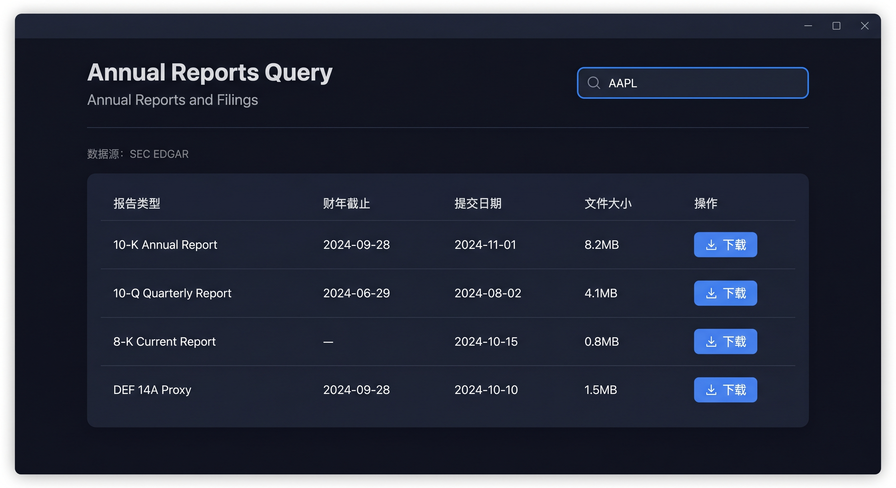
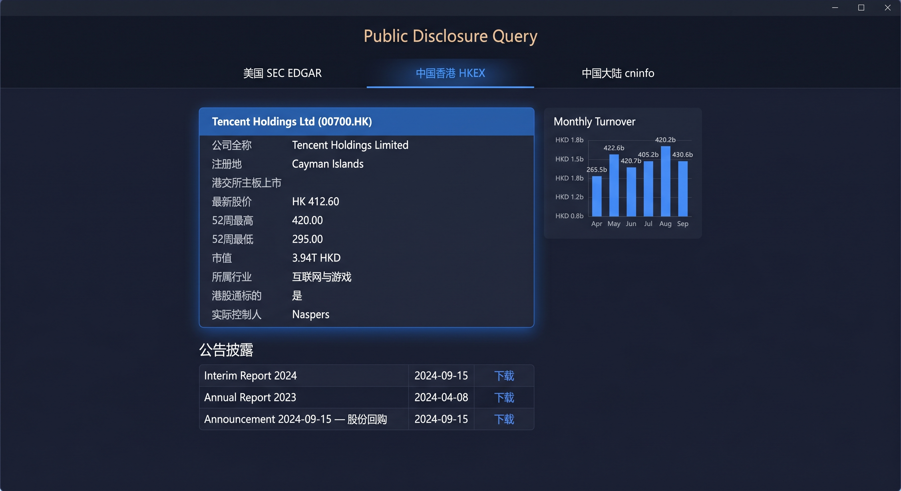
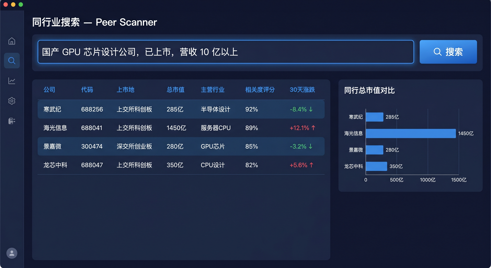
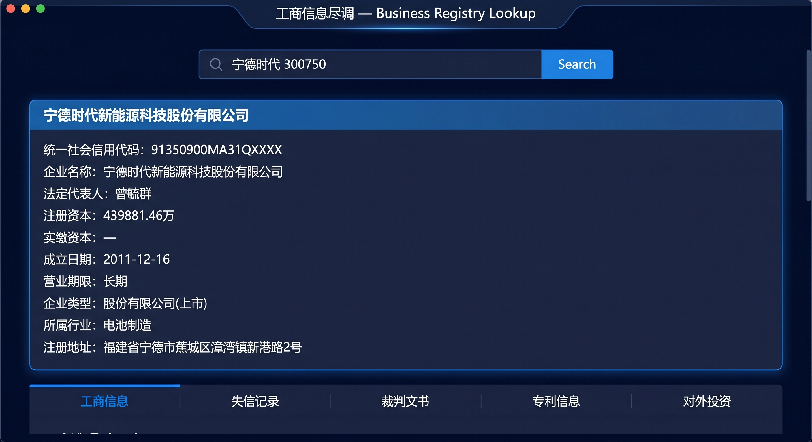

<p align="center">
  
</p>

<h1 align="center">Pre-Diligence Lab</h1>

<p align="center">
  一级市场预研与风控Lab<br>
  Primary-Market Investment Research &amp; Risk-Control Workbench
</p>

<p align="center">
  <a href="#下载与安装">下载</a> &middot;
  <a href="#快速上手">快速上手</a> &middot;
  <a href="#功能详解">功能详解</a> &middot;
  <a href="#llm-配置">LLM 配置</a> &middot;
  <a href="#从源码构建">从源码构建</a> &middot;
  <a href="#许可证">许可证</a>
</p>

---

## 关于本项目

**Pre-Diligence Lab** 是面向一级市场投研人员的财务风控调研系统，覆盖 Pre-IPO / 私募 / 并购 / 硬科技尽调等场景下进行数据调研、财务指标计算、财务风控分析。

本应用将分散在 SEC EDGAR、HKEXnews、巨潮资讯、东方财富、中基协 AMAC、Yahoo Finance 等十余个公开数据源的财务披露、行情、新闻、公告、备案信息聚合到统一界面，所有用户输入（搜索历史、收藏、API Key、配置）均存储在本地，**不向任何第三方服务端上传**。LLM 为可选功能，未配置时所有数据抓取、计算、图表功能亦可正常使用，仅无法利用Agent能力进行深度分析。

---

## 下载与安装

### 方式一：下载预编译包（推荐普通用户）

到 [Releases](https://github.com/AlanSong2077/PreDiligenceLab/releases) 页面下载对应平台的安装包：

| 平台 | 文件 | 说明 |
| --- | --- | --- |
| Windows | `PreDiligenceLab-Setup-x.y.z.exe` | Inno Setup 一键安装，含开始菜单、卸载入口 |
| Windows | `PreDiligenceLab-x.y.z-windows-x64.zip` | 解压即用，不写注册表 |
| macOS | `PreDiligenceLab-x.y.z-macOS.zip` | 解压后将 `PreDiligenceLab.app` 拖入 `/Applications` |
> macOS 首次启动若提示「无法验证开发者」，请在「系统设置 → 隐私与安全性」中点击「仍要打开」。

### 方式二：从源码运行（开发者）

```bash
git clone https://github.com/AlanSong2077/PreDiligenceLab.git
cd PreDiligenceLab
python -m venv .venv
source .venv/bin/activate          # Windows: .venv\Scripts\activate
pip install -r requirements.txt
python main.py
```

启动后侧边栏将默认显示年报查询标签页。在搜索框输入股票代码（例如 `AAPL`、`600519`、`00700`）并按回车即可开始。注意，SEC可能会对部分国内IP做封禁。

---

## 快速上手

应用启动后，主界面由左侧栏（导航 + 搜索 + 一键分析 + 收藏）与右侧主内容区构成：

<p align="center">
  
</p>


---

## 功能

### 1. 年报查询

跨市场检索上市公司的年报、半年报、季报、临时公告原始文件。点击「下载」后 PDF 直接落到本地目录。

<p align="center">
  
</p>
数据来源说明：
| 市场 | 数据源 | 覆盖文件类型 |
| --- | --- | --- |
| 美国 | SEC EDGAR | 10-K, 10-Q, 8-K, DEF 14A, S-1, 20-F |
| 中国香港 | HKEXnews | 年报、中期报告、ESG 报告、通函、公告 |
| 中国大陆 | 巨潮资讯（cninfo） | 年报、半年报、季报、临时公告、招股说明书 |

### 2. 公开信息披露

按市场分标签展示企业基础披露信息，包括公司全称、注册地、上市板、市值、52 周高低、所属行业、实际控制人 / 主要股东，以及最新公告列表。

<p align="center">
  
</p>

### 3. 消息引擎

分一二级投资市场，自动调研多源新闻聚合，根据消息情绪识别利好利空。抓取来源包括东方财富、新浪财经、Baidu 财经、Google News RSS、Yahoo Finance、HKEX 投资者公告、36氪、量子位等。

<p align="center">
  
</p>

按时间倒序展示，可按以下类别过滤：

- **公司公告**：监管披露、回购、分红、人事变动
- **行业新闻**：所属行业的政策、市场动态
- **研报**：券商与卖方研究观点
- **利好 / 利空**：基于标题与正文的语义分类标签

### 4. 同行业搜索

自然语言描述公司特征，由 LLM 推荐最相近的 A / H / 美股上市公司，并按相关度评分排序。

<p align="center">
  
</p>

例如输入「国产 GPU 芯片设计公司，已上市，营收 10 亿以上」，返回：

| 公司 | 代码 | 上市地 | 总市值 | 主营行业 | 相关度 | 30 日涨跌 |
| --- | --- | --- | --- | --- | --- | --- |
| 寒武纪 | 688256.SH | 上交所科创板 | 285 亿 | AI 芯片 | 92% | -8.4% |
| 海光信息 | 688041.SH | 上交所科创板 | 1450 亿 | 服务器 CPU | 89% | +12.1% |
| 景嘉微 | 300474.SZ | 深交所创业板 | 280 亿 | GPU 芯片 | 85% | -3.2% |
| 龙芯中科 | 688047.SH | 上交所科创板 | 350 亿 | CPU 设计 | 82% | +5.6% |

### 5. 私募基金

对接中基协 AMAC 公开备案数据，按管理人 / 基金名检索，展示登记编号、登记日期、注册资本、法定代表人、注册地，以及在管基金列表与基金类型 / 规模。

<p align="center">
  
</p>

### 6. 工商信息尽调

该功能暂未开启。需要提供天眼查/企查查API Key通过接口统一访问数据。数据包括：统一社会信用代码 / 公司名 / 股票代码检索，展示工商注册基本信息，并提供以下四类公开层穿透，股权穿透、投资信息最多允许到下探到三级。

- **失信记录**：被执行人、限高、终本案件
- **裁判文书**：涉案身份、案由、审理法院、判决结果
- **专利信息**：发明专利、实用新型、外观设计的申请 / 授权时间线
- **对外投资**：子公司、参股公司、对外担保明细

<p align="center">
  
</p>

### 7. 财务计算器

输入一份未上市公司简化的财报数据，自动搜集同行业上市公司基准，计算财务指标并对比。覆盖半导体 / 软件开发 / 计算机设备 / 通信设备 / 医疗器械 / 生物制品 / 化学制药 / 新能源 / 光伏设备 / 储能 / 汽车整车 / 汽车零部件 / 消费电子 / 家用电器 / 银行 / 证券 / 保险 / 房地产开发 / 建筑装饰 / 食品饮料 / 白酒 / 零售 / 化工 / 钢铁 / 有色金属 / 物流 / 航空 / 港口等多行业。

<p align="center">
  
</p>

**指标分组**

| 分组 | 包含指标 |
| --- | --- |
| 盈利能力 | 毛利率、营业利润率、净利润率、ROE、ROA、扣非 ROE |
| 营运能力 | 应收周转天数、存货周转天数、总资产周转率 |
| 偿债能力 | 资产负债率、流动比率、速动比率、利息保障倍数 |
| 现金流质量 | CFO / 净利润、自由现金流、资本开支强度 |
| 估值 | PE-TTM、PE-Forward、PB、PS、EV/EBITDA |
| 风险评分 | Altman Z-Score、Beneish M-Score、Piotroski F-Score |


### 8. 财务风险因子识别

开发中。针对硬科技 / 半导体 / AI 行业设计的风险信号识别工具。暂定包括以下方向，主要方式是通过规则判断 + LLM分析。

1. **真实性检验**：收入与现金匹配度、应收占比、毛利率偏离度、收入与存货交叉验证
2. **现金流检验**：净现比、现金消耗速度、融资依赖度
3. **盈利质量检验**：扣非净利润、研发费用率、毛利率趋势、研发资本化率
4. **行业特殊性**：研发资本化合理性、存货跌价、政府补助占比、商誉与无形资产

### 9. 一键分析

作为补充能力，引入LLM能力支持问答讲解，上下文在会话内保留。

---

## LLM 配置

LLM 为可选功能。未配置时所有数据抓取、计算、图表功能均可使用，仅无法使用「一键分析」与「同行业搜索」中的 AI 推荐。

### 支持的 Provider

| Provider | Base URL | 默认模型 |
| --- | --- | --- |
| OpenAI | `https://api.openai.com/v1` | `gpt-4o-mini` |
| DeepSeek | `https://api.deepseek.com/v1` | `deepseek-chat` |
| 通义千问（Qwen） | `https://dashscope.aliyuncs.com/compatible-mode/v1` | `qwen-turbo` |
| 自定义（OpenAI 兼容） | 用户填写 | 用户填写 |


### 配置步骤

1. 启动应用，点击右上角「设置」→「LLM 配置」
2. 选择 Provider，填入 API Key（仅本地保存）
3. 点击「测试连接」验证
4. 点击「保存」即可

支持的请求格式：

- OpenAI：原生 `response_format` + `json_schema` Structured Outputs（gpt-4o / o1 / o3 系列）
- DeepSeek / 自定义：`json_object` mode
- 通义千问：通过 `json_object` 参数启用 JSON 返回

---

## 数据与隐私

### 数据来源

所有数据均来自**公开可访问**的金融信息披露平台：

| 数据源 | URL | 内容 |
| --- | --- | --- |
| SEC EDGAR | `https://www.sec.gov/cgi-bin/browse-edgar` | 美股年报、季报、临时公告 |
| HKEXnews | `https://www1.hkexnews.hk` | 港股年报、中期报告、ESG 报告、公告 |
| 巨潮资讯（cninfo） | `https://www.cninfo.com.cn` | A 股定期报告、临时公告、招股书 |
| 东方财富 | `https://data.eastmoney.com` | A / H / US 行情、财务数据 |
| 中基协 AMAC | `https://www.amac.org.cn` | 私募基金管理人、基金备案 |
| Yahoo Finance（yfinance） | `https://query1.finance.yahoo.com` | 美 / 港 / 全球行情 |
| AKShare | `https://akshare.akfamily.xyz` | A 股 / 期货 / 基金数据 |
| Baidu / Google RSS | 公开 RSS | 新闻聚合 |

项目中不包含任何遥测、埋点、广告 SDK。所有网络请求均直接发往目标数据源，不会经过任何中转服务器。

---

## 常见问题

**Q1. 搜索框输入代码后没反应？**
检查代码格式：美股用字母代码（AAPL），A 股用 6 位数字（600519），港股用 4 ~ 5 位数字（00700）。带后缀也可，如 `00700.HK`、`600519.SS`。

**Q2. 下载年报很慢？**
SEC EDGAR 跨大洲访问仍可能慢。HKEX 与 cninfo 一般较快，需要耐心等待一下。

**Q3. 财务计算器的指标显示「—」？**
表示对应分母为零或必填字段缺失。例如营业利润率为「—」，通常是营业收入或营业利润为空。

---

## 贡献

提交 Issue / PR 前请阅读：

- [`.github/PULL_REQUEST_TEMPLATE.md`](.github/PULL_REQUEST_TEMPLATE.md) — 提交前自检清单（务必进行隐私审查）
- [`.github/ISSUE_TEMPLATE/`](.github/ISSUE_TEMPLATE) — Bug 与 Feature Request 模板

---

## 许可证

本项目基于 [Apache License 2.0](LICENSE) 开源。

---

## 免责声明

本项目仅为内部投研财务风控辅助工具。使用者应自行核实所有数据，并对投资决策负全部责任。
